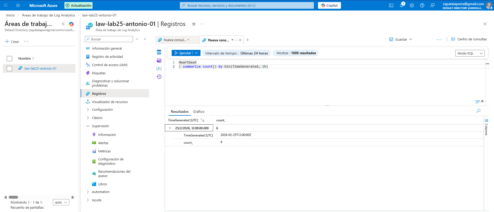

# Lab 25 – Log Analytics y consultas KQL
## Objetivo
Centralizar logs en un Log Analytics Workspace y consultar datos con KQL para validar la salud y actividad de una máquina virtual.

---

## Qué he hecho en este laboratorio

1. He creado un Log Analytics Workspace para recopilar y consultar logs.
2. He configurado la VM para enviar telemetría al workspace.
3. He ejecutado una consulta KQL sobre la tabla `Heartbeat` para comprobar que la máquina está reportando correctamente.

---

## Arquitectura y concepto

Log Analytics es el repositorio de logs de Azure Monitor. Una vez que los recursos envían telemetría al workspace, se puede consultar con KQL (Kusto Query Language) para hacer análisis, detección y troubleshooting.

La tabla `Heartbeat` es una forma rápida de validar que el agente está enviando información desde la VM.

---

## Configuración utilizada

- Log Analytics Workspace: `law-lab25-antonio-01`
- Origen de datos: VM (Azure Monitor)
- Consulta KQL:
  - `Heartbeat | summarize count() by bin(TimeGenerated, 1h)`

---

## Evidencias

### 01 – Consulta KQL (Heartbeat por horas)

Se muestra el resultado de la consulta agrupando registros de Heartbeat por horas.

---

## Qué le diría a un cliente o en entrevista

“Uso Log Analytics para centralizar logs y KQL para investigar qué está pasando en la infraestructura. Con Heartbeat verifico rápido si una VM está reportando y desde ahí ya puedo tirar de consultas más específicas.”

---

